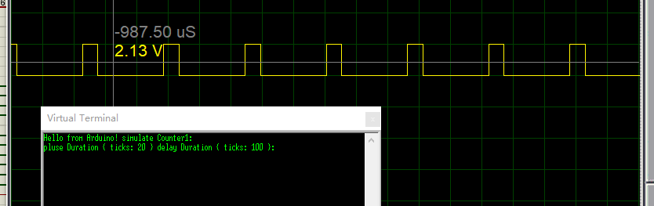

implement embedded_hal::timer::CountDown trait for avr TC


## example

see examples dir

usage overview is like below.
```rust
    use avr_counter::{prelude::*, Counter1};

    const CPUFREQ: u32 = 16_000_000; //16MHz
    let mut counter = Counter1::<{ CPUFREQ }>::new();

    let pluse_length = fugit::MicrosDurationU32::micros(20);
    let delay = pluse_length * 5;
    loop {
        let _ = counter.start(pluse_length);
        let _ = x_step.set_high();
        let _ = nb::block!(counter.wait());

        let _ = counter.start(delay);
        let _ = x_step.set_low();
        let _ = nb::block!(counter.wait());
    }

```
the snippets execute result is like below:




## how to review final codes

cargo-expand is a useful tool to review rust macro expand result.
```
$ cargo +nightly install cargo-expand
```
e.g. manual review  atmega328p Counter0/Counter1/Counter2 final codes


execute  `cargo expand`
```
avr-counter/$ cargo expand --features atmega328p counter
```
will get snippets:
```rust
...
mod counter {

    /// $Name support embedded_hal::timer::CountDown
    ///
    pub struct Counter0<const CPU_FREQ: u32> {}
    impl<const CPU_FREQ: u32> Counter0<CPU_FREQ> {
        ...
        fn _start(
            &mut self,
            timeout: crate::fugit::MicrosDurationU32,
        ) -> Result<(), ()> {
            unsafe {
                if let Ok((prescale, ticks)) = self.tc_calculate_overf(timeout) {
                    self.tc_set_ctcmode(prescale, ticks);
                } else {
                    return Err(());
                }
            }
            Ok(())
        }
....
```
